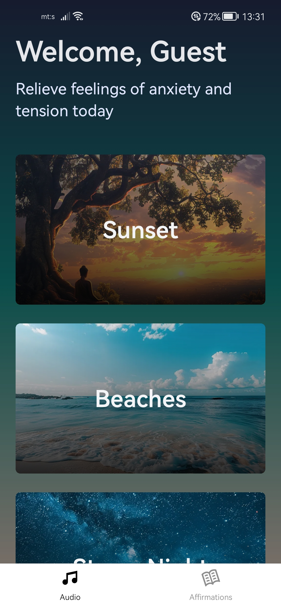
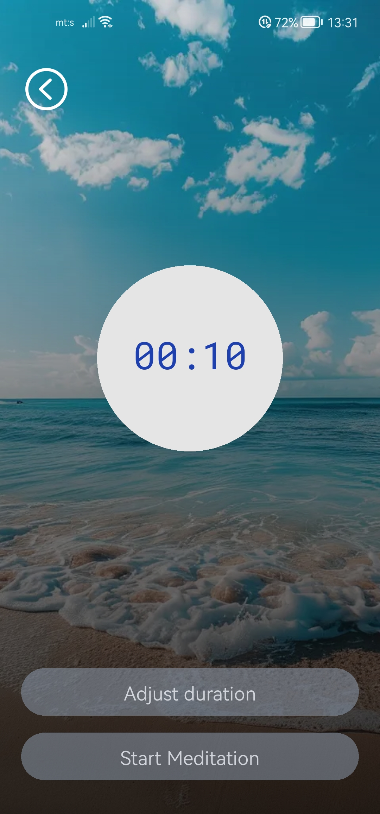
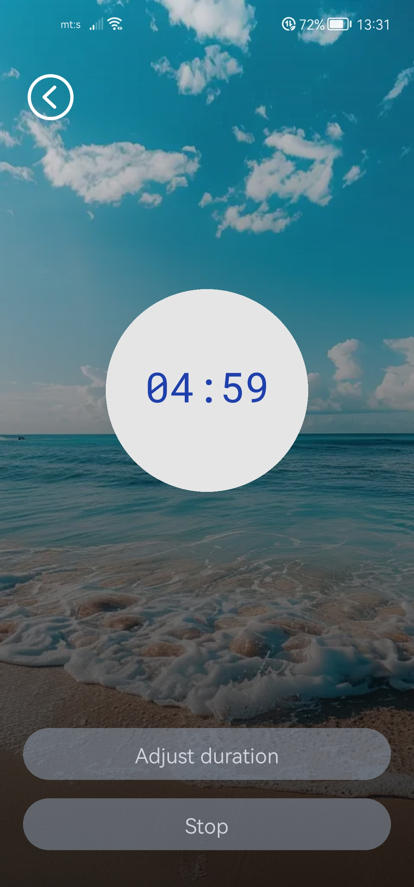
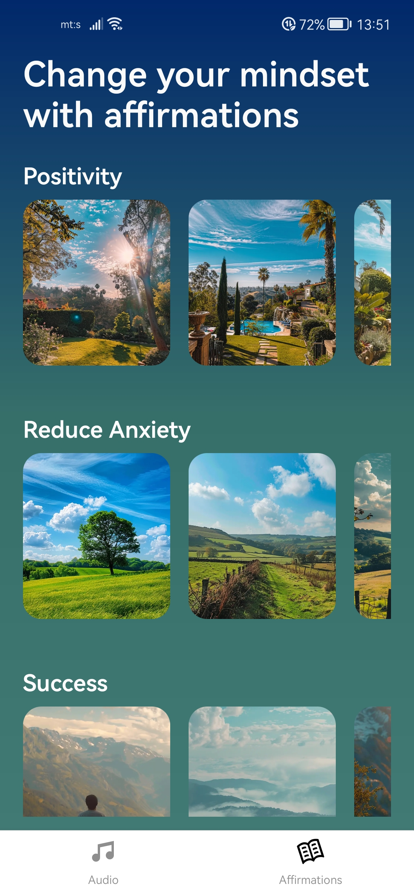

# Welcome to your Expo app 👋

This is an [Expo](https://expo.dev) project created with [`create-expo-app`](https://www.npmjs.com/package/create-expo-app).

## Get started

1. Install dependencies

   ```bash
   npm install
   ```

2. Start the app

   ```bash
    npx expo start
   ```

## Screenshots

### Home Screen


### Audio Screen



### Timer Screen



### Set Timer Screen


### Audio Screen


### Countdown Screen



### Affirmations Screen



### Affirmations Screen with text


